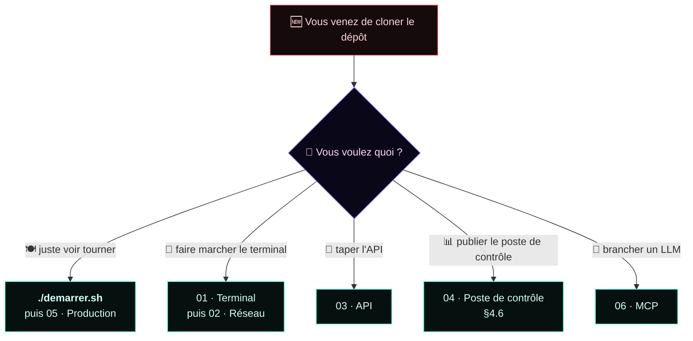

# 📚 La documentation

**[↩️ Retour au README](../README.md)**

---

Six documents, dans l'ordre où on en a besoin : d'abord faire marcher le terminal,
ensuite le mettre sur le réseau, puis tout le reste.

| | 📖 Document | 🎯 Ce qu'il couvre | ⏱️ |
|:---:|:---|:---|:---:|
| 📱 | **[01 · Terminal Skorpio](01-terminal-skorpio.md)** | Reprendre la main sur le terminal, régler le lecteur code-barres, déposer le client en mémoire persistante, l'usage quotidien, et quoi faire quand ça ne marche pas. | 🟢 **à lire en premier** |
| 📶 | **[02 · Réseau](02-reseau.md)** | Monter le Wi-Fi du terminal, ouvrir le port côté PC, prouver la liaison, fixer l'adresse, lancer le serveur au démarrage. | 🟢 |
| 🔌 | **[03 · API](03-api.md)** | Les deux écritures d'une même réponse (JSON et `clé=valeur`), les codes HTTP, toutes les routes, tous les paramètres, et les appels en ligne de commande. | 🟡 |
| 📊 | **[04 · Poste de contrôle](04-vitrine.md)** | Le site public : installation, pourquoi la lecture seule tient, le temps réel sans rien installer, les routes, les 10 KPI, la publication sur Internet. | 🟡 |
| 🐳 | **[05 · Production](05-production.md)** | Les conteneurs : mise en route, l'UID (cause n°1 d'échec), les montages, le fuseau, l'image, le durcissement, l'exploitation, le diagnostic. | 🔴 |
| 🤖 | **[06 · MCP](06-mcp.md)** | Brancher un LLM local sur le frigo : les 7 outils, les ressources, les invites, ce qu'un modèle **ne peut pas** faire. | 🟡 |

---

## 🗺️ Par où commencer

---

## 🧠 L'architecture en une image

| 🏷️ Couche | 🎛️ Rôle | 🚪 Port | 📖 Doc |
|:---|:---|:---:|:---|
| 🧬 **04 · Agentic Experience** | le LLM raisonne sur le stock réel | — | [06](06-mcp.md) |
| 🤖 **03 · MCP Orchestration** | 7 outils, 3 ressources, 3 invites | `8082` | [06](06-mcp.md) |
| 📊 **02 · Cognitive Analytics** | 10 KPI, 5 vues, diffusion temps réel | `8081` | [04](04-vitrine.md) |
| ⚙️ **01 · Autonomous Core** | SQLite, Open Food Facts, photos, FEFO | `8080` | [03](03-api.md) · [05](05-production.md) |
| 📡 **00 · Edge Capture** | une gâchette, zéro invite | — | [01](01-terminal-skorpio.md) · [02](02-reseau.md) |

---

## 🖼️ Les illustrations

Toutes les images de cette documentation sont **produites par le dépôt lui-même** — aucune
maquette, aucun montage.

| 📁 Dossier | 🔧 Produit par | 🎬 Contenu |
|:---|:---|:---|
| `images/terminal/` | `./demarrer.sh --apercu` | les 19 écrans du client, rendus en 240 × 320 dans un serveur X virtuel |
| `images/veille/` | `./demarrer.sh --veille` | les 55 économiseurs, animés 90 images chacun puis photographiés |
| `images/vitrine/` | navigateur sans interface sur `vitrine.py` | les 5 vues du poste de contrôle, en thème clair et sombre |
| `images/*.svg` | à la main | le bandeau et le schéma de la pile |

---

**[↩️ Retour au README](../README.md)** · **[📱 01 · Terminal](01-terminal-skorpio.md)**

